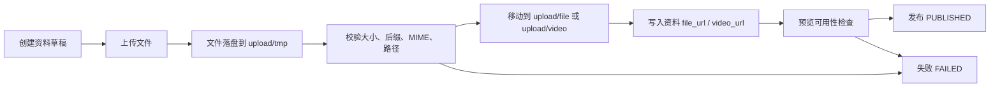
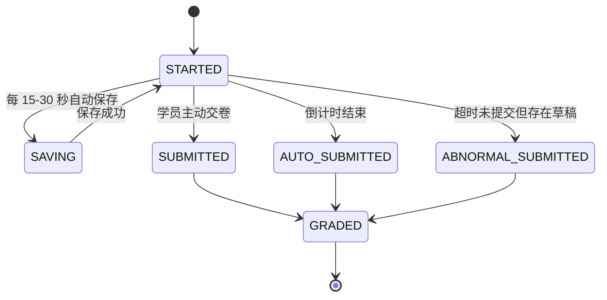
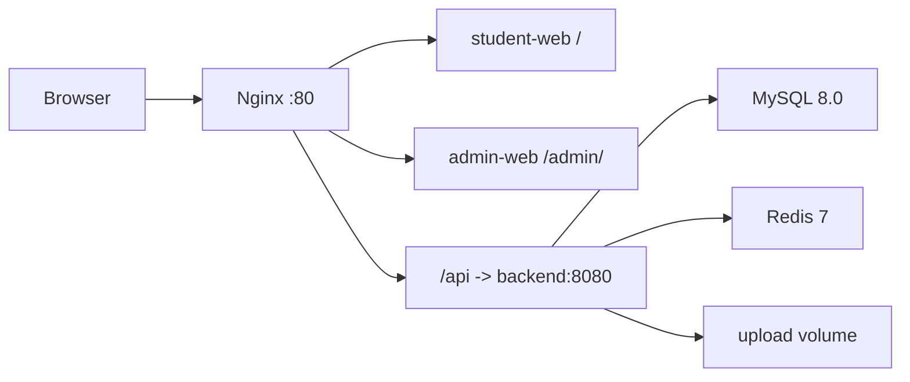

# 线上教学平台深度优化审核方案

## 1. 优化目标与边界

本方案基于项目级权威材料、当前 `online-teaching-platform` 代码结构和现有阶段文档编写，目标是在不改变前后端分离架构、不引入重型新框架的前提下，把系统从“可演示闭环”提升到“可审核、可扩展、可压测、可部署”的工程状态。

本轮优化覆盖三条主线：

- 逻辑清晰：统一接口、鉴权、RBAC、状态机、异常处理与日志规范。
- 功能完全：补齐考试异常交卷、答题自动保存、判分细则、事务与并发边界。
- 亮点加强：Redis 缓存、Docker Compose 一键部署、数据智能接口预留。

## 2. 接口规范与鉴权优化

### 2.1 统一 RESTful API 响应结构

现有后端已使用 `Result<T>`，建议保留 `{ code, msg, data }` 结构，同时细化状态码语义：

| code | 场景 | 前端处理 |
|---|---|---|
| 0 | 成功 | 正常渲染 `data` |
| 400 | 参数错误、业务校验失败 | 弹出 `msg`，停留当前页面 |
| 401 | 未登录或 Token 失效 | 清理本地 Token，跳转登录 |
| 403 | 已登录但无权限 | 弹出无权访问，返回上一页 |
| 404 | 资源不存在 | 展示空态或错误页 |
| 409 | 并发冲突、重复提交 | 展示已提交结果或提示刷新 |
| 429 | 请求过于频繁 | 提示稍后重试 |
| 500 | 服务端异常 | 弹出统一错误提示，记录日志编号 |

分页返回继续使用：

```json
{
  "code": 0,
  "msg": "success",
  "data": {
    "list": [],
    "total": 100,
    "page": 1,
    "limit": 10
  }
}
```

建议新增 `requestId` 日志字段，但不强制改变前端接口结构。可先在响应头返回 `X-Request-Id`，避免破坏既有页面。

### 2.2 Token 身份校验

现有 `AuthInterceptor` 已读取请求头 `Token` 并查询 `t_token`。建议演进为三层校验：

1. Token 存在性：缺失直接返回 401。
2. Token 有效性：查询 `t_token`，校验过期时间、用户状态。
3. 访问权限：写入 `request.userId`、`request.role`、`request.xueyuanId`，后续业务层只信任后端上下文，不信任前端传入的 userId。

Token 生命周期建议：

| 项 | 建议 |
|---|---|
| 过期时间 | 2 小时滑动过期，最长 7 天 |
| 存储 | 当前阶段保留 `t_token`；引入 Redis 后可使用 `login:token:{token}` |
| 退出登录 | 删除 DB/Redis Token |
| 多端策略 | 可允许多端并存；如需强控制，按 `userId + clientType` 保留最新 Token |

### 2.3 RBAC 权限拦截

角色保持两类：`admin`、`student`。后端必须以接口维度做权限判断。

| 接口区域 | 权限 | 说明 |
|---|---|---|
| `/api/auth/login`、`/api/auth/register` | public | 注册仅允许学员 |
| `/api/news/page`、`/api/banners/list` | public | 首页公开信息 |
| `/api/resources/page`、`/api/resources/{id}` | public 或 login | 资料浏览可按业务配置 |
| `/api/exam/start/{paperId}`、`/api/exam/submit` | student | 管理员不直接参加考试 |
| `/api/admin/**`、资料/试卷/试题维护接口 | admin | 学员禁止访问 |
| `/api/messages/page`、`/api/storeup/page`、`/api/examrecords/page` | owner 或 admin | 学员只查本人，管理员可查全量 |

建议将现有字符串判断逐步替换为注解式权限：

```java
@RequireRole("admin")
@PostMapping("/api/news/save")
public Result<String> saveNews(@RequestBody News news) { ... }

@RequireOwner(resource = "examRecord", id = "#id")
@GetMapping("/api/examrecords/{id}")
public Result<?> detail(@PathVariable Long id) { ... }
```

当前项目若不新增 AOP，可先维护 `PermissionRule` 列表：

```text
method + pathPattern + roles + ownerCheck
POST /api/exam/submit student false
GET  /api/examrecords/{id} student,admin true
POST /api/resources/save admin false
```

这样能避免 `AuthInterceptor` 中大量 `uri.contains(...)` 带来的误判。

## 3. 复杂业务状态机与数据一致性

### 3.1 资料上传、存储、预览状态机

资料核心状态建议从单一 `status` 扩展为：

| 状态 | 含义 | 可执行操作 |
|---|---|---|
| DRAFT | 草稿，资料信息未完整 | 编辑、上传文件、删除 |
| UPLOADING | 文件上传中 | 前端展示进度，禁止发布 |
| PROCESSING | 文件已保存，等待预览检查 | 后端生成预览 URL、校验 MIME |
| PUBLISHED | 已发布 | 学员可浏览、收藏、下载、评论 |
| OFFLINE | 已下架 | 管理员可编辑、重新发布 |
| FAILED | 上传或校验失败 | 重新上传、删除 |

建议流程：



一致性保障：

- 文件名使用 UUID，原始文件名只做展示字段，避免路径穿越与重名覆盖。
- 上传先进入临时目录，数据库写入成功后再移动到正式目录；若数据库失败，清理临时文件。
- 删除资料建议先软删除或下架，再由定时任务清理孤儿文件。
- 下载接口不直接暴露磁盘路径，统一通过 `/api/file/download?type=&name=` 校验后输出。
- 预览仅允许白名单类型：`pdf`、`mp4`、`jpg/png`；其他类型只下载不预览。

### 3.2 试卷生成、答题、自动判分状态机

试卷状态：

| 状态 | 含义 |
|---|---|
| DRAFT | 管理员编辑中 |
| READY | 题目和总分校验通过 |
| PUBLISHED | 学员可考试 |
| ARCHIVED | 归档，不再开放新考试 |

考试记录状态：

| 状态 | 含义 |
|---|---|
| STARTED | 已进入考试 |
| SAVING | 保存答题进度中 |
| SUBMITTED | 正常交卷 |
| AUTO_SUBMITTED | 倒计时结束自动交卷 |
| ABNORMAL_SUBMITTED | 断网/断电后恢复提交或后台兜底提交 |
| GRADED | 判分完成 |
| INVALID | 被管理员判定无效 |

建议流程：



一致性保障：

- 开始考试时创建 `exam_attempt`，唯一键 `(paper_id, user_id, attempt_no)`。
- 自动保存写入 `exam_answer_draft` 或 Redis Hash，并带 `version` 字段。
- 提交使用幂等键 `submit_id`，唯一键防止重复交卷。
- 判分与写入错题本放在同一个事务内，保证考试记录、明细、错题数据一致。

## 4. 考试场景闭环补全

### 4.1 答题进度自动保存

前端策略：

- 进入考试后每 15 秒保存一次。
- 切题、修改答案、页面隐藏前立即触发保存。
- 本地同时写入 `localStorage`，键名建议 `exam:draft:{paperId}:{userId}`。
- 网络失败时保留本地草稿并展示“正在离线保存”状态。

后端接口建议：

| 方法 | 路径 | 说明 |
|---|---|---|
| POST | `/api/exam/attempts` | 开始考试，返回 attemptId |
| PUT | `/api/exam/attempts/{attemptId}/draft` | 保存草稿 |
| GET | `/api/exam/attempts/{attemptId}/draft` | 恢复草稿 |
| POST | `/api/exam/attempts/{attemptId}/submit` | 提交试卷 |

### 4.2 异常交卷

异常交卷处理规则：

- 如果考试结束时间已到，但只有草稿没有提交，后台定时任务按最后草稿生成 `ABNORMAL_SUBMITTED`。
- 如果学员恢复网络后提交，后端以服务器时间判断：超过允许宽限期则拒绝主动提交，改为读取最后草稿判分。
- 宽限期建议 60-180 秒，用于处理网络抖动，具体值写入试卷配置。
- 对无任何草稿的异常考试，记录为 0 分或缺考，由管理员在后台查看。

### 4.3 多选题半对机制

建议规则：

| 情况 | 得分 |
|---|---|
| 与标准答案完全一致 | 满分 |
| 选择项全部属于正确答案，但漏选 | `题目分值 * 选对数量 / 正确答案数量 * 0.6` |
| 选择了任一错误选项 | 0 分 |
| 未作答 | 0 分 |

示例：正确答案 `A,B,C`，题目 10 分。

- 选 `A,B,C`：10 分。
- 选 `A,B`：`10 * 2 / 3 * 0.6 = 4` 分，可按四舍五入得 4 分。
- 选 `A,D`：0 分。

### 4.4 填空题模糊匹配

填空题建议支持以下规则：

- 去除前后空格，全角逗号转半角逗号。
- 英文大小写不敏感。
- 中文标点归一化。
- 支持多个可接受答案，用 `|` 分隔，如 `Java|java`。
- 多空题按空位分别判分，空位之间用 `;` 分隔。
- 可配置相似度阈值，默认不启用复杂相似度；若启用，短答案阈值 100%，长答案阈值 85%。

## 5. 并发、事务与削峰

### 5.1 500+ 并发交卷风险

高并发交卷主要风险：

- 同一学生重复点击导致重复记录。
- 大量同时读试题、写考试记录导致数据库连接池打满。
- 判分过程同步写错题本，延长事务时间。
- 首页高频数据与考试模板竞争数据库资源。

### 5.2 数据库锁与幂等方案

建议新增唯一约束：

```sql
ALTER TABLE examrecord
  ADD COLUMN attempt_id BIGINT NULL,
  ADD COLUMN submit_id VARCHAR(64) NULL,
  ADD COLUMN status VARCHAR(32) NOT NULL DEFAULT 'GRADED',
  ADD UNIQUE KEY uk_examrecord_attempt (attempt_id),
  ADD UNIQUE KEY uk_examrecord_submit (submit_id);
```

提交时：

1. 根据 `attemptId` 查询考试尝试记录，并使用 `SELECT ... FOR UPDATE` 锁住该行。
2. 如果状态已提交，直接返回已有 `recordId`，保证幂等。
3. 如果未提交，在同一事务中完成判分、写 `examrecord`、写错题本。
4. 提交完成后释放锁。

MySQL InnoDB 行锁足以支撑“同一 attempt 串行提交”，不会锁住整张表。

### 5.3 队列削峰方案

当压测显示同步判分超过 3 秒时，采用轻量削峰：

- 前端提交后，后端先保存原始答案，返回 `SUBMIT_RECEIVED`。
- 后端将 `attemptId` 放入 Redis Stream 或数据库任务表 `exam_grade_task`。
- 后台消费者异步判分并写入成绩。
- 学员结果页轮询 `/api/examrecords/{id}/status`，状态从 `GRADING` 变为 `GRADED` 后展示分数。

当前课程项目可先使用“数据库任务表 + 定时线程”实现，不强依赖消息队列。

## 6. 防作弊与安全

### 6.1 基础防切屏

前端记录以下行为：

- `visibilitychange`：页面隐藏次数。
- `blur/focus`：窗口失焦次数。
- `copy/paste/contextmenu`：复制粘贴和右键。
- 全屏退出事件：退出全屏次数。

策略建议：

- 首次切屏：提醒。
- 第 2-3 次：记录风险，结果页提示已记录。
- 超过阈值：自动交卷或标记 `risk_level=high`，由管理员复核。

注意：浏览器端防作弊不能作为绝对证据，只能作为风险记录，最终以后台审计为准。

### 6.2 SQL 注入防护

- MyBatis XML 中所有用户输入使用 `#{}`，禁止 `${}` 拼接查询条件。
- 排序字段使用后端白名单映射，如 `sort=addtime_desc` 转成固定 SQL 片段。
- 模糊查询只拼接值，不拼接列名。
- 分页参数限制范围：`page >= 1`，`1 <= limit <= 100`。
- 后台批量删除 ID 列表必须校验为数字集合，禁止直接拼接。

### 6.3 敏感数据保护

- 密码使用 BCrypt 存储，禁止明文或 MD5。
- 登录、注册、修改密码必须通过 HTTPS 部署。
- 返回用户信息时隐藏密码、Token、身份证等敏感字段。
- 手机号、邮箱可在前端展示时脱敏，如 `138****1234`。
- 日志中禁止打印密码、Token、完整手机号。

## 7. 异常兜底与日志规范

### 7.1 全局异常处理

现有 `GlobalExceptionHandler` 可继续保留，建议细化：

| 异常 | code | 日志级别 |
|---|---|---|
| 参数校验异常 | 400 | WARN |
| 未登录异常 | 401 | INFO |
| 无权限异常 | 403 | WARN |
| 资源不存在 | 404 | INFO |
| 并发冲突/重复提交 | 409 | WARN |
| 业务异常 | 400 | WARN |
| 系统异常 | 500 | ERROR |

系统异常不要把 Java 堆栈或数据库错误直接返回前端，前端只展示“服务器繁忙，请稍后重试”，详细信息写日志。

### 7.2 日志字段

每条关键日志建议包含：

```text
requestId, userId, role, method, uri, clientIp, costMs, statusCode, bizModule, action
```

关键业务日志：

- 登录成功/失败。
- 管理员新增、修改、删除资料/试卷/试题。
- 学员开始考试、保存草稿、提交试卷、异常交卷。
- 文件上传、下载、删除。
- 权限拦截与越权访问。

## 8. Redis 性能优化方案

### 8.1 缓存对象

| 缓存对象 | Key | TTL | 失效时机 |
|---|---|---|---|
| 轮播图 | `home:banners` | 10 分钟 | 管理员新增/编辑/删除轮播 |
| 最新公告 | `home:news:latest:{limit}` | 5 分钟 | 公告发布、编辑、删除 |
| 热门资料 | `home:resources:hot:{limit}` | 5 分钟 | 资料发布、下架；下载量可延迟刷新 |
| 试卷模板 | `exam:paper:{paperId}` | 30 分钟 | 试卷或试题变更 |
| Token | `login:token:{token}` | 2 小时滑动 | 登录、退出、过期 |
| 答题草稿 | `exam:draft:{attemptId}` | 考试结束后 24 小时 | 交卷后保留审计期 |

### 8.2 缓存策略

- 首页高频读使用 Cache Aside：先读 Redis，未命中查 MySQL 并回填。
- 管理端写操作后主动删除相关缓存，避免脏数据长期存在。
- 热门资料下载数可使用 Redis 计数器累加，再每分钟批量落库，降低 DB 写压力。
- 试卷详情进入考试前从缓存读取，缓存内容不包含正确答案；判分服务读取后端内部完整模板。

压测目标：

- 首页接口 P95 小于 500ms。
- 考试开始接口 P95 小于 1s。
- 500 并发交卷同步方案 P95 小于 3s；若超过则启用异步判分。

## 9. Docker Compose 容器化部署

本轮已新增容器化骨架：

- `docker-compose.yml`：编排 MySQL、Redis、后端、Nginx。
- `backend/Dockerfile`：后端 Jar 构建与运行。
- `deploy/nginx/Dockerfile`：构建学员端、管理端并用 Nginx 托管。
- `deploy/nginx/default.conf`：前端路由与 `/api` 反向代理。
- `.dockerignore`：降低构建上下文体积。

部署拓扑：



启动命令：

```bash
docker compose up -d --build
```

访问地址：

- 学员端：首页 `http://localhost/`
- 管理端：`http://localhost/admin/`
- 后端健康接口可通过 `http://localhost/api/...` 验证

环境一致性收益：

- MySQL、Redis、后端 JDK、Nginx 版本由镜像固定，减少 Windows/Linux 差异。
- 上传文件挂载到 Docker volume，避免容器重建丢失。
- 前端静态资源由 Nginx 统一托管，接口路径通过 `/api` 转发。

## 10. 数据智能预研

### 10.1 可沉淀的数据

当前考试记录、答题明细、错题本可形成学习画像：

| 数据 | 用途 |
|---|---|
| 试卷记录 | 学员整体掌握程度、趋势 |
| 题目正确率 | 识别难题、知识点薄弱项 |
| 错题本 | 个体弱点、复习推荐 |
| 资料浏览/收藏/下载 | 学习兴趣与资源热度 |
| 论坛/留言 | 学习问题主题分析 |

### 10.2 建议预留字段

题目表可预留：

- `knowledge_point`：知识点。
- `difficulty`：难度，1-5。
- `score_rate`：历史得分率，可离线统计。

考试明细表建议记录：

- `question_id`
- `user_answer`
- `correct_answer`
- `score`
- `is_correct`
- `knowledge_point`
- `answer_cost_seconds`

### 10.3 预留分析接口

| 方法 | 路径 | 说明 |
|---|---|---|
| GET | `/api/analytics/student/summary` | 学员学习概览 |
| GET | `/api/analytics/student/weak-points` | 薄弱知识点 |
| GET | `/api/analytics/resources/recommend` | 推荐资料 |
| GET | `/api/admin/analytics/exam/{paperId}` | 试卷质量分析 |
| GET | `/api/admin/analytics/questions/hard` | 高错题排行 |

先用 SQL 统计和规则推荐即可：错题知识点命中次数越高，优先推荐同知识点资料；未来再接入机器学习模型。

## 11. 分阶段落地建议

| 阶段 | 内容 | 验收标准 |
|---|---|---|
| A | 修正 JDK 8、完善异常码、整理权限规则 | 后端可在 JDK 8 构建，越权接口返回 403 |
| B | 考试 attempt、草稿保存、异常交卷 | 断网恢复后能继续答题或按草稿交卷 |
| C | 多选半对、填空模糊匹配、错题明细 | 判分规则可解释，错题本准确 |
| D | Redis 首页缓存与试卷缓存 | 首页和考试开始接口压测达标 |
| E | Docker Compose 部署 | Windows/Linux 均能一键启动 |
| F | 数据分析接口 | 能输出薄弱知识点和推荐资料 |

## 12. 本轮审核结论

当前项目已具备前后端分离、统一响应、Token 拦截、资料/考试/互动核心接口等基础。主要短板集中在考试异常场景、细粒度 RBAC、并发幂等、缓存和部署一致性。本方案给出的优化路径能够在不推翻现有架构的前提下逐步落地，优先建议从“JDK 8 一致性、权限规则、考试草稿与幂等提交、Docker Compose”四项开始。
