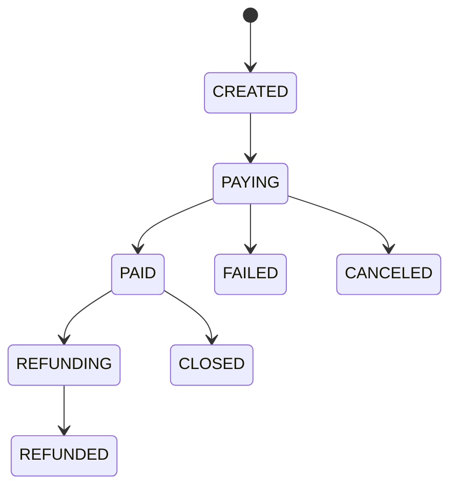

# 线上教学平台企业级架构优化专项汇报

## 0. 汇报定位

本文档面向《线上教学平台》的后续企业级演进，重点解决三类问题：

- **Clear Logic**：统一前端技术生态、统一 API 契约、统一异常模型、统一权限与服务边界。
- **Functional Completeness**：补齐断点续考、智能错题本、严谨实体关系、实时通讯、对象存储、支付网关等商业化链路。
- **Highlight Amplification**：将“高并发在线考试与毫秒级自动判分”打造为系统核心技术护城河。

当前项目仍可保持 Spring Boot 2.7.18、JDK 8、MyBatis、MySQL、Vue 前后端分离结构。本文提出的是可渐进落地的工程蓝图，不要求一次性推翻现有实现。

---

## 1. 第一维度：架构规范与底层逻辑绝对清晰化

### 1.1 彻底解决异构前端负担

当前系统采用：

| 端 | 当前技术栈 | 问题 |
|---|---|---|
| 学员端 | Vue 3 + Vite + Element Plus + Pinia | 现代化程度较高 |
| 管理端 | Vue 2.7 + Vue CLI + Element UI + Vuex | 生态老化，组件不可直接复用 |

异构前端的核心成本不是“能否运行”，而是长期维护中的技术熵增：

- 两套 UI 组件库：Element UI 与 Element Plus API 不完全一致。
- 两套状态管理：Vuex 与 Pinia 心智模型不同。
- 两套构建链：Vue CLI 与 Vite 的配置、构建速度、插件体系割裂。
- 两套组合方式：Options API 与 Composition API 混用后公共逻辑难沉淀。

#### 1.1.1 目标架构

```text
online-teaching-platform/
  packages/
    shared-api/       # Axios、接口类型、统一错误处理
    shared-ui/        # 表格、搜索栏、上传器、题目编辑器
    shared-utils/     # Token、时间、分页、权限、文件工具
  student-web/        # Vue3 + Vite
  admin-web/          # Vue3 + Vite
  backend/
```

#### 1.1.2 Vue2 管理端平滑迁移路线

| 阶段 | 目标 | 具体动作 | 验收标准 |
|---|---|---|---|
| Phase 1 | 接口层先统一 | 抽离 `shared-api`，Vue2/Vue3 均调用同一组 API 函数 | 两端登录、分页、上传、错误拦截逻辑一致 |
| Phase 2 | 通用能力组件化 | 抽离分页表格、查询栏、上传按钮、题目选项编辑器 | 管理端重复页面代码下降 |
| Phase 3 | 新建 Vue3 管理端壳 | 使用 Vite、Pinia、Element Plus 搭建新后台 | `/admin/login`、`/admin/dashboard` 可访问 |
| Phase 4 | 按模块迁移 | 学员管理 -> 资料管理 -> 试卷管理 -> 试题管理 -> 系统管理 | 每迁移一个模块完成接口回归 |
| Phase 5 | 删除 Vue2 技术债 | 移除 Vue CLI、Vuex、Element UI | 两端统一 Vue3 生态 |

#### 1.1.3 重构前后对比

| 项 | 重构前 | 重构后 |
|---|---|---|
| 构建工具 | Vue CLI + Vite | 全部 Vite |
| 状态管理 | Vuex + Pinia | 全部 Pinia |
| 组件库 | Element UI + Element Plus | 全部 Element Plus |
| 业务 API | 两端各写一套 | `shared-api` 单一事实源 |
| 组合逻辑 | Options API 分散 | Composition API + composables |
| 维护复杂度 | 双生态并行 | 单生态演进 |

---

### 1.2 RESTful API 契约化与网关设计

#### 1.2.1 28 个模块接口设计哲学

全部模块遵守四条原则：

1. **资源名词化**：路径表达资源，不表达数据库表名。
2. **动作 HTTP 化**：查询用 `GET`，创建用 `POST`，替换/修改用 `PUT`，删除用 `DELETE`。
3. **权限后端化**：前端菜单隐藏只负责体验，后端必须判定角色与数据归属。
4. **响应契约化**：所有接口统一返回 `Result<T>`，分页统一返回 `PageResult<T>`。

| 模块 | RESTful 资源建议 | 关键接口 |
|---|---|---|
| Auth | `/api/auth` | login、logout、me |
| User | `/api/users` | 管理员账号维护 |
| Xueyuan | `/api/students` | 学员 CRUD、个人资料 |
| Resource Type | `/api/resource-types` | 资料分类 |
| Resource | `/api/resources` | 资料上传、预览、下载 |
| Resource Comment | `/api/resources/{id}/comments` | 资料评论 |
| Storeup | `/api/favorites` | 收藏、取消收藏 |
| Exam Paper | `/api/exam-papers` | 试卷管理 |
| Exam Question | `/api/exam-questions` | 试题管理 |
| Exam Attempt | `/api/exam-attempts` | 开始考试、保存草稿、交卷 |
| Exam Record | `/api/exam-records` | 成绩记录 |
| Wrong Question | `/api/wrong-questions` | 错题本 |
| Forum | `/api/forums` | 帖子 |
| Forum Comment | `/api/forums/{id}/comments` | 帖子评论 |
| Message | `/api/messages` | 留言反馈 |
| News | `/api/news` | 公告 |
| Banner | `/api/banners` | 轮播图 |
| Upload | `/api/uploads` | 文件上传 |
| Preview | `/api/previews` | 文件预览 |
| Analytics | `/api/analytics` | 学习画像 |
| Notification | `/api/notifications` | 站内通知 |
| WebSocket | `/ws` | 实时通道 |
| Payment Order | `/api/payment-orders` | 订单 |
| Payment Callback | `/api/payment-callbacks` | 支付回调 |
| Object Storage | `/api/object-storage` | 分片上传签名 |
| Audit Log | `/api/audit-logs` | 管理审计 |
| System Config | `/api/system-configs` | 系统配置 |
| Health | `/api/health` | 健康检查 |

#### 1.2.2 统一响应体模型

```java
public class Result<T> {
    private int code;
    private String msg;
    private T data;
    private String requestId;
    private long timestamp;

    private Result(int code, String msg, T data) {
        this.code = code;
        this.msg = msg;
        this.data = data;
        this.requestId = RequestIdHolder.get();
        this.timestamp = System.currentTimeMillis();
    }

    public static <T> Result<T> success(T data) {
        return new Result<>(0, "success", data);
    }

    public static <T> Result<T> fail(int code, String msg) {
        return new Result<>(code, msg, null);
    }
}
```

分页模型：

```java
public class PageResult<T> {
    private List<T> list;
    private long total;
    private int page;
    private int limit;
}
```

#### 1.2.3 全局异常接管

```java
@RestControllerAdvice
public class GlobalExceptionHandler {

    @ExceptionHandler(BizException.class)
    public Result<Void> handleBiz(BizException ex) {
        return Result.fail(ex.getCode(), ex.getMessage());
    }

    @ExceptionHandler(AccessDeniedException.class)
    public Result<Void> handleAccessDenied(AccessDeniedException ex) {
        return Result.fail(403, "无权访问该资源");
    }

    @ExceptionHandler(MethodArgumentNotValidException.class)
    public Result<Void> handleValidation(MethodArgumentNotValidException ex) {
        return Result.fail(400, "参数校验失败");
    }

    @ExceptionHandler(DuplicateSubmitException.class)
    public Result<Void> handleDuplicate(DuplicateSubmitException ex) {
        return Result.fail(409, "重复提交，请勿刷新或重复点击");
    }

    @ExceptionHandler(Exception.class)
    public Result<Void> handleSystem(Exception ex) {
        log.error("system exception, requestId={}", RequestIdHolder.get(), ex);
        return Result.fail(500, "服务器繁忙，请稍后重试");
    }
}
```

#### 1.2.4 网关设计

单体阶段可由 Nginx 承担轻量网关角色：

```text
Nginx
  /api/auth/**          -> backend
  /api/exam/**          -> backend
  /api/resources/**     -> backend
  /upload/**            -> backend static mapping
  /ws/**                -> backend websocket
```

微服务阶段演进为 Spring Cloud Gateway：

| 网关能力 | 说明 |
|---|---|
| JWT 验证 | 在网关先做签名与过期校验 |
| 限流 | 登录、交卷、上传等接口限流 |
| 熔断 | 某服务异常时快速失败 |
| 灰度 | 按用户、角色或 Header 灰度 |
| 审计 | 统一记录 requestId、userId、path、cost |

---

### 1.3 消除微服务演进阻碍

#### 1.3.1 Service 层解耦目标

当前单体常见风险：

- Controller 直接拼接业务条件。
- 一个 Service 调多个不相关 Mapper。
- 业务状态散落在字符串、数字状态码中。
- 考试判分、错题、记录写入混在一个长方法。

目标拆分：

| 层 | 职责 |
|---|---|
| Controller | 参数接收、权限注解、调用应用服务 |
| Application Service | 编排用例，如“提交试卷” |
| Domain Service | 领域规则，如判分、错题推荐 |
| Repository/Mapper | 数据访问 |
| Event Publisher | 发布领域事件 |

提交试卷用例应拆为：

```text
ExamAttemptService       # 管理考试尝试状态
ExamSubmissionService    # 接收交卷与幂等
EvaluationEngine         # 判分引擎
WrongQuestionService     # 错题沉淀
ExamRecordService        # 成绩归档
```

#### 1.3.2 Database per Service 路线

| 阶段 | 数据形态 | 说明 |
|---|---|---|
| 单体同库 | 所有表在 `online_teaching` | 当前状态 |
| 单库多 Schema | `user_schema`、`exam_schema`、`resource_schema` | 先清晰边界 |
| 服务独占库 | 每个服务仅访问自己的库 | 微服务目标 |
| 事件驱动一致性 | MQ 传递领域事件 | 避免跨库事务 |

服务拆分建议：

| 服务 | 独占数据 | 发布事件 |
|---|---|---|
| user-service | 用户、学员、角色 | `UserRegistered` |
| resource-service | 资料、分类、评论 | `ResourcePublished` |
| exam-service | 试卷、试题、尝试、记录、错题 | `ExamSubmitted`、`ExamGraded` |
| notification-service | 通知、WebSocket 会话 | `NotificationPushed` |
| payment-service | 订单、支付流水 | `PaymentSucceeded` |

---

## 2. 第二维度：功能完备性校验与业务生态闭环

### 2.1 抗干扰测评引擎闭环

#### 2.1.1 断点续考机制

设计原则：**学员每次点击答案都必须被视为有价值事件，但不能每次都打爆数据库。** 前端采用防抖算法 **Debounce** 聚合高频点击，后端使用 Redis 保存最近答案快照。

链路：

```text
点击选项/输入填空
 -> 前端状态立即更新
 -> debounce 800ms
 -> PUT /api/exam-attempts/{attemptId}/draft
 -> Redis 保存答案快照
 -> 本地 localStorage 保存兜底快照
 -> 提交或定时任务归档 MySQL
```

Redis Key：

| Key | 类型 | TTL | 内容 |
|---|---|---|---|
| `exam:draft:{attemptId}` | Hash | 考试结束后 24h | `answersJson`、`version`、`updatedAt` |
| `exam:heartbeat:{attemptId}` | String | 2min | 最近在线时间 |
| `exam:submit-lock:{attemptId}` | String | 30s | 防重复提交 |

前端伪代码：

```javascript
const saveDraft = debounce(async () => {
  const payload = {
    answers,
    version: draftVersion + 1,
    clientTime: Date.now()
  }
  localStorage.setItem(draftKey, JSON.stringify(payload))
  await api.saveExamDraft(attemptId, payload)
}, 800)
```

恢复策略：

| 场景 | 策略 |
|---|---|
| 刷新页面 | 先拉 Redis 草稿，再比对 localStorage |
| 断网恢复 | 使用更新时间更晚的版本 |
| Redis 无草稿 | 使用 MySQL 最近归档草稿 |
| 超时未提交 | 后端使用最后快照异常交卷 |

#### 2.1.2 智能错题本体系

错题本应从“错题列表”升级为“学习干预系统”。

| 能力 | 设计 |
|---|---|
| 相似题推荐 | 基于知识点、题型、难度、错误原因标签 |
| 周期复测 | 1/3/7/15 天自动生成错题重测试卷 |
| 掌握度模型 | 最近答对次数、答题耗时、错误频率共同计算 |
| 资源推荐 | 错误知识点映射相关资料 |

错题标签示例：

```text
knowledge_point = "Java 集合"
mistake_tag = "概念混淆"
difficulty = 3
similar_group = "java-collection-list-map"
```

周期组卷逻辑：

```text
每天 02:00 扫描 wrong_question
 -> 找出到期复测题
 -> 按知识点和难度去重
 -> 生成 review_exam_paper
 -> 推送通知给学员
```

---

### 2.2 打破信息孤岛的交互闭环

#### 2.2.1 泛化外键反模式治理

泛化外键形式：

```text
ref_id + type
```

问题：

| 问题 | 影响 |
|---|---|
| 无真实外键约束 | 删除资源后产生孤儿评论 |
| 查询不可预测 | 无法针对不同实体建立最优索引 |
| 权限判断混乱 | 不同 type 的 owner 规则不同 |
| 代码分支膨胀 | Service 内到处 `if type == ...` |

建议拆分：

```sql
CREATE TABLE resource_comment (
  id BIGINT PRIMARY KEY AUTO_INCREMENT,
  resource_id BIGINT NOT NULL,
  user_id BIGINT NOT NULL,
  content TEXT NOT NULL,
  status TINYINT NOT NULL DEFAULT 1,
  created_at DATETIME NOT NULL,
  KEY idx_res_comment_res_time (resource_id, created_at),
  KEY idx_res_comment_user_time (user_id, created_at)
) ENGINE=InnoDB DEFAULT CHARSET=utf8mb4;

CREATE TABLE forum_comment (
  id BIGINT PRIMARY KEY AUTO_INCREMENT,
  forum_id BIGINT NOT NULL,
  user_id BIGINT NOT NULL,
  parent_id BIGINT NULL,
  content TEXT NOT NULL,
  status TINYINT NOT NULL DEFAULT 1,
  created_at DATETIME NOT NULL,
  KEY idx_forum_comment_forum_time (forum_id, created_at),
  KEY idx_forum_comment_parent (parent_id)
) ENGINE=InnoDB DEFAULT CHARSET=utf8mb4;
```

#### 2.2.2 WebSocket 全双工实时通讯

实时通讯目标：

| 场景 | 推送对象 | 时效 |
|---|---|---|
| 帖子被评论 | 帖主 | 毫秒级 |
| 评论被回复 | 被回复人 | 毫秒级 |
| 系统容灾公告 | 全体在线用户 | 毫秒级 |
| 考试异常提醒 | 指定考生 | 毫秒级 |

Spring WebSocket 配置示例：

```java
@Configuration
@EnableWebSocketMessageBroker
public class WebSocketConfig implements WebSocketMessageBrokerConfigurer {

    @Override
    public void registerStompEndpoints(StompEndpointRegistry registry) {
        registry.addEndpoint("/ws")
            .setAllowedOriginPatterns("*")
            .withSockJS();
    }

    @Override
    public void configureMessageBroker(MessageBrokerRegistry registry) {
        registry.enableSimpleBroker("/topic", "/queue");
        registry.setApplicationDestinationPrefixes("/app");
        registry.setUserDestinationPrefix("/user");
    }
}
```

推送示例：

```java
messagingTemplate.convertAndSendToUser(
    String.valueOf(ownerUserId),
    "/queue/notifications",
    new NotificationVO("FORUM_COMMENT", "你的帖子有新评论")
);
```

---

### 2.3 横向扩展与生态兼容闭环

#### 2.3.1 对象存储分片上传

视频大文件必须从应用服务器本地磁盘迁出，推荐 S3/OSS。

流程：

```text
POST /api/object-storage/multipart/init
 -> 返回 uploadId 与 objectKey
前端分片直传 OSS/S3
POST /api/object-storage/multipart/complete
 -> 后端校验分片并保存资源 URL
```

状态机：

| 状态 | 含义 |
|---|---|
| INITIATED | 创建上传任务 |
| UPLOADING | 分片上传中 |
| COMPLETING | 合并分片 |
| COMPLETED | 上传完成 |
| FAILED | 上传失败 |
| ABORTED | 用户取消 |

#### 2.3.2 第三方支付网关

商业化平台支付状态必须以支付平台 Webhook 为准。接入对象可包括 Stripe、支付宝等第三方支付网关，系统侧仅维护订单状态机与幂等回调处理，不把支付平台的瞬时返回当作最终成功依据。



支付表核心字段：

```sql
CREATE TABLE payment_order (
  id BIGINT PRIMARY KEY AUTO_INCREMENT,
  order_no VARCHAR(64) NOT NULL,
  user_id BIGINT NOT NULL,
  amount DECIMAL(10,2) NOT NULL,
  currency VARCHAR(16) NOT NULL,
  provider VARCHAR(32) NOT NULL,
  provider_trade_no VARCHAR(128),
  status VARCHAR(32) NOT NULL,
  created_at DATETIME NOT NULL,
  paid_at DATETIME NULL,
  UNIQUE KEY uk_payment_order_no (order_no),
  KEY idx_payment_user_time (user_id, created_at),
  KEY idx_payment_provider_trade (provider, provider_trade_no)
) ENGINE=InnoDB DEFAULT CHARSET=utf8mb4;
```

---

## 3. 第三维度：高并发考试系统技术护城河

### 3.1 1000 人瞬时交卷削峰架构

同步判分在 1000 人瞬时交卷时会将压力全部打到 Web 线程、数据库连接池和判分逻辑上。目标架构必须把“接收交卷”和“完成判分”解耦。

```text
Student
 -> Submit API
 -> Idempotent Check
 -> Save Raw Submission
 -> RabbitMQ/Kafka
 -> Evaluation Worker Pool
 -> examrecord / wrong_question
 -> WebSocket Notify
```

RabbitMQ 设计：

| 组件 | 名称 | 作用 |
|---|---|---|
| Exchange | `exam.submit.exchange` | 接收交卷事件 |
| Queue | `exam.submit.queue` | 判分消费 |
| DLQ | `exam.submit.dlq` | 判分失败死信 |
| Routing Key | `exam.submit` | 标准交卷 |
| Idempotent Key | `submitId` | 防重复提交 |

提交接口伪代码：

```java
@Transactional(
    propagation = Propagation.REQUIRED,
    isolation = Isolation.READ_COMMITTED,
    rollbackFor = Exception.class
)
public SubmitAck submit(SubmitCommand command) {
    if (examRecordMapper.existsBySubmitId(command.getSubmitId())) {
        return SubmitAck.duplicated(command.getSubmitId());
    }

    ExamAttempt attempt = attemptMapper.selectForUpdate(command.getAttemptId());
    if (attempt.isSubmitted()) {
        return SubmitAck.alreadySubmitted(attempt.getRecordId());
    }

    rawSubmissionMapper.insert(command.toRawSubmission());
    attemptMapper.markSubmitted(command.getAttemptId(), command.getSubmitId());
    mqPublisher.publish("exam.submit.exchange", "exam.submit", command);

    return SubmitAck.received(command.getSubmitId());
}
```

判分消费者：

```java
@RabbitListener(queues = "exam.submit.queue")
public void consume(SubmitCommand command) {
    try {
        evaluationApplicationService.grade(command.getAttemptId());
    } catch (Exception ex) {
        log.error("grade failed, attemptId={}", command.getAttemptId(), ex);
        throw ex;
    }
}
```

---

### 3.2 Strategy Pattern 自动判分引擎

#### 3.2.1 领域模型

```java
public class Question {
    private Long id;
    private String type;
    private String answer;
    private String answerRegex;
    private BigDecimal score;
    private String knowledgePoint;
}

public class StudentAnswer {
    private Long questionId;
    private String answer;
}

public class EvaluationResult {
    private BigDecimal score;
    private boolean correct;
    private String reason;
}
```

#### 3.2.2 策略接口

```java
public interface QuestionEvaluator {
    boolean supports(String questionType);
    EvaluationResult evaluate(Question question, StudentAnswer answer);
}
```

#### 3.2.3 单选题策略

```java
@Component
public class SingleChoiceEvaluator implements QuestionEvaluator {

    @Override
    public boolean supports(String questionType) {
        return "single".equals(questionType);
    }

    @Override
    public EvaluationResult evaluate(Question question, StudentAnswer answer) {
        String right = normalize(question.getAnswer());
        String user = normalize(answer.getAnswer());
        if (right.equals(user)) {
            return EvaluationResult.full(question.getScore());
        }
        return EvaluationResult.zero("单选答案不匹配");
    }
}
```

#### 3.2.4 多选容错给分策略

```java
@Component
public class MultipleChoiceEvaluator implements QuestionEvaluator {

    @Override
    public boolean supports(String questionType) {
        return "multiple".equals(questionType);
    }

    @Override
    public EvaluationResult evaluate(Question question, StudentAnswer answer) {
        Set<String> right = splitAnswer(question.getAnswer());
        Set<String> user = splitAnswer(answer.getAnswer());

        if (user.equals(right)) {
            return EvaluationResult.full(question.getScore());
        }
        if (!right.containsAll(user)) {
            return EvaluationResult.zero("包含错误选项");
        }
        if (user.isEmpty()) {
            return EvaluationResult.zero("未作答");
        }

        BigDecimal score = question.getScore()
            .multiply(BigDecimal.valueOf(user.size()))
            .divide(BigDecimal.valueOf(right.size()), 2, RoundingMode.HALF_UP)
            .multiply(BigDecimal.valueOf(0.6));

        return EvaluationResult.partial(score, "漏选按 60% 系数给分");
    }
}
```

#### 3.2.5 填空正则匹配策略

```java
@Component
public class FillBlankRegexEvaluator implements QuestionEvaluator {

    @Override
    public boolean supports(String questionType) {
        return "fill".equals(questionType);
    }

    @Override
    public EvaluationResult evaluate(Question question, StudentAnswer answer) {
        String normalized = normalizeText(answer.getAnswer());
        Pattern pattern = Pattern.compile(question.getAnswerRegex(), Pattern.CASE_INSENSITIVE);
        if (pattern.matcher(normalized).matches()) {
            return EvaluationResult.full(question.getScore());
        }
        return EvaluationResult.zero("填空答案未命中正则规则");
    }
}
```

#### 3.2.6 判分引擎聚合

```java
@Service
public class EvaluationEngine {
    private final List<QuestionEvaluator> evaluators;

    public EvaluationEngine(List<QuestionEvaluator> evaluators) {
        this.evaluators = evaluators;
    }

    public EvaluationResult evaluate(Question question, StudentAnswer answer) {
        return evaluators.stream()
            .filter(evaluator -> evaluator.supports(question.getType()))
            .findFirst()
            .orElseThrow(() -> new BizException(400, "不支持的题型：" + question.getType()))
            .evaluate(question, answer);
    }
}
```

---

### 3.3 ACID 事务与隔离级别

交卷链路拆成两个事务：

| 事务 | 内容 | 特点 |
|---|---|---|
| 提交事务 | 锁定 attempt、保存原始答案、投递 MQ | 极短事务 |
| 判分事务 | 读取答案、计算得分、写成绩、写错题 | Worker 异步执行 |

判分事务配置：

```java
@Transactional(
    propagation = Propagation.REQUIRED,
    isolation = Isolation.READ_COMMITTED,
    timeout = 10,
    rollbackFor = Exception.class
)
public void grade(Long attemptId) {
    ExamAttempt attempt = attemptMapper.selectForUpdate(attemptId);
    if (attempt.isGraded()) {
        return;
    }

    List<Question> questions = questionMapper.findByPaperId(attempt.getPaperId());
    List<StudentAnswer> answers = answerMapper.findByAttemptId(attemptId);

    GradeSummary summary = evaluationEngine.grade(questions, answers);

    examRecordMapper.insert(summary.toExamRecord());
    wrongQuestionMapper.batchInsert(summary.toWrongQuestions());
    attemptMapper.markGraded(attemptId, summary.getTotalScore());
}
```

选择 `READ_COMMITTED` 的原因：

| 隔离级别 | 是否适合 | 原因 |
|---|---|---|
| READ_UNCOMMITTED | 否 | 可能读到脏数据 |
| READ_COMMITTED | 是 | 防脏读，锁粒度较低，适合高并发判分 |
| REPEATABLE_READ | 可选 | MySQL 默认，但可能增加锁等待 |
| SERIALIZABLE | 否 | 并发吞吐损失过大 |

关键锁：

```sql
SELECT *
FROM exam_attempt
WHERE id = #{attemptId}
FOR UPDATE;
```

该锁只串行化同一场考试尝试，不影响其他学员并发交卷。

---

### 3.4 数据库索引艺术与 DDL

#### 3.4.1 考试尝试表

```sql
CREATE TABLE exam_attempt (
  id BIGINT PRIMARY KEY AUTO_INCREMENT,
  paper_id BIGINT NOT NULL,
  user_id BIGINT NOT NULL,
  status VARCHAR(32) NOT NULL,
  submit_id VARCHAR(64) NULL,
  start_time DATETIME NOT NULL,
  submit_time DATETIME NULL,
  graded_time DATETIME NULL,
  version INT NOT NULL DEFAULT 0,
  UNIQUE KEY uk_attempt_user_paper_active (user_id, paper_id, status),
  UNIQUE KEY uk_attempt_submit_id (submit_id),
  KEY idx_attempt_paper_status_time (paper_id, status, submit_time),
  KEY idx_attempt_user_time (user_id, start_time)
) ENGINE=InnoDB DEFAULT CHARSET=utf8mb4;
```

#### 3.4.2 考试记录表

```sql
CREATE TABLE examrecord (
  id BIGINT PRIMARY KEY AUTO_INCREMENT,
  attempt_id BIGINT NOT NULL,
  paper_id BIGINT NOT NULL,
  user_id BIGINT NOT NULL,
  submit_id VARCHAR(64) NOT NULL,
  score DECIMAL(6,2) NOT NULL,
  total_score DECIMAL(6,2) NOT NULL,
  correct_count INT NOT NULL,
  wrong_count INT NOT NULL,
  status VARCHAR(32) NOT NULL,
  submit_time DATETIME NOT NULL,
  created_at DATETIME NOT NULL,
  UNIQUE KEY uk_examrecord_attempt (attempt_id),
  UNIQUE KEY uk_examrecord_submit (submit_id),
  KEY idx_record_user_time_cover (user_id, submit_time DESC, id, paper_id, score, status),
  KEY idx_record_paper_time_cover (paper_id, submit_time DESC, id, user_id, score, status),
  KEY idx_record_status_time (status, submit_time)
) ENGINE=InnoDB DEFAULT CHARSET=utf8mb4;
```

#### 3.4.3 试卷表

```sql
CREATE TABLE exampaper (
  id BIGINT PRIMARY KEY AUTO_INCREMENT,
  name VARCHAR(200) NOT NULL,
  status TINYINT NOT NULL,
  duration INT NOT NULL,
  total_score INT NOT NULL,
  created_at DATETIME NOT NULL,
  updated_at DATETIME NOT NULL,
  KEY idx_paper_status_time_cover (status, created_at DESC, id, name, duration, total_score)
) ENGINE=InnoDB DEFAULT CHARSET=utf8mb4;
```

#### 3.4.4 用户表

```sql
CREATE TABLE t_users (
  id BIGINT PRIMARY KEY AUTO_INCREMENT,
  username VARCHAR(100) NOT NULL,
  password VARCHAR(255) NOT NULL,
  role VARCHAR(50) NOT NULL,
  status TINYINT NOT NULL,
  created_at DATETIME NOT NULL,
  UNIQUE KEY uk_user_username (username),
  KEY idx_user_role_status (role, status, id)
) ENGINE=InnoDB DEFAULT CHARSET=utf8mb4;
```

#### 3.4.5 B+ 树避免回表原理

联合索引 `idx_record_user_time_cover(user_id, submit_time, id, paper_id, score, status)` 的叶子节点已经包含列表页所需字段。当学员查询自己的考试记录时：

```sql
SELECT id, paper_id, score, status, submit_time
FROM examrecord
WHERE user_id = ?
ORDER BY submit_time DESC
LIMIT 10;
```

MySQL 可直接在二级索引叶子节点上完成过滤、排序和字段返回，不必再通过主键 `id` 回到聚簇索引读取整行。对于考试记录这种高频列表查询，覆盖索引能显著减少随机 IO 与 Buffer Pool 压力。

---

### 3.5 JWT + Spring Security 军工级越权防御

#### 3.5.1 安全原则

| 风险 | 防御 |
|---|---|
| 前端隐藏菜单被绕过 | 后端 `@PreAuthorize` |
| 学员访问管理端接口 | `hasRole('ADMIN')` |
| 学员改 URL 查看他人错题 | `@authz.ownWrongQuestion(...)` |
| Token 被篡改 | JWT 签名校验 |
| Token 泄露 | 短过期 + Redis 黑名单 |

#### 3.5.2 Spring Security 配置

```java
@Configuration
@EnableWebSecurity
@EnableGlobalMethodSecurity(prePostEnabled = true)
public class SecurityConfig {

    @Bean
    public SecurityFilterChain securityFilterChain(HttpSecurity http) throws Exception {
        return http
            .csrf().disable()
            .sessionManagement()
            .sessionCreationPolicy(SessionCreationPolicy.STATELESS)
            .and()
            .authorizeRequests()
            .antMatchers("/api/auth/**", "/api/news/**", "/api/banners/list").permitAll()
            .anyRequest().authenticated()
            .and()
            .addFilterBefore(jwtAuthenticationFilter(), UsernamePasswordAuthenticationFilter.class)
            .build();
    }
}
```

#### 3.5.3 JWT 过滤器

```java
public class JwtAuthenticationFilter extends OncePerRequestFilter {

    @Override
    protected void doFilterInternal(HttpServletRequest request,
                                    HttpServletResponse response,
                                    FilterChain chain)
            throws ServletException, IOException {
        String token = resolveToken(request);
        if (StringUtils.hasText(token) && jwtService.validate(token)) {
            LoginUser loginUser = jwtService.parse(token);
            UsernamePasswordAuthenticationToken authentication =
                new UsernamePasswordAuthenticationToken(
                    loginUser,
                    null,
                    loginUser.getAuthorities()
                );
            SecurityContextHolder.getContext().setAuthentication(authentication);
        }
        chain.doFilter(request, response);
    }
}
```

#### 3.5.4 垂直越权防御

```java
@PreAuthorize("hasRole('ADMIN')")
@PostMapping("/api/exam-papers")
public Result<Long> createPaper(@RequestBody ExamPaperCreateCommand command) {
    return Result.success(examPaperService.create(command));
}
```

#### 3.5.5 水平越权防御

```java
@Component("authz")
public class AuthorizationService {

    public boolean ownExamRecord(Long recordId, Authentication authentication) {
        LoginUser user = (LoginUser) authentication.getPrincipal();
        return examRecordMapper.existsByIdAndUserId(recordId, user.getUserId());
    }

    public boolean ownWrongQuestion(Long wrongQuestionId, Authentication authentication) {
        LoginUser user = (LoginUser) authentication.getPrincipal();
        return wrongQuestionMapper.existsByIdAndUserId(wrongQuestionId, user.getUserId());
    }
}
```

接口：

```java
@PreAuthorize("hasRole('ADMIN') or @authz.ownExamRecord(#id, authentication)")
@GetMapping("/api/exam-records/{id}")
public Result<ExamRecordDetailVO> detail(@PathVariable Long id) {
    return Result.success(examRecordService.detail(id));
}

@PreAuthorize("@authz.ownWrongQuestion(#id, authentication)")
@GetMapping("/api/wrong-questions/{id}")
public Result<WrongQuestionVO> wrongQuestion(@PathVariable Long id) {
    return Result.success(wrongQuestionService.detail(id));
}
```

该体系将权限判定移动到方法级，能够同时拦截：

- 学员访问管理员接口。
- 学员访问他人的考试记录。
- 学员访问他人的错题。
- 管理员接口被直接 HTTP 调用绕过前端菜单。

---

## 4. 落地优先级

| 优先级 | 事项 | 原因 |
|---|---|---|
| P0 | 交卷幂等、attempt 状态、Redis 草稿 | 直接影响考试可靠性 |
| P0 | Spring Security 方法级权限 | 直接影响越权安全 |
| P1 | 判分 Strategy Pattern | 降低题型扩展成本 |
| P1 | 考试记录联合索引 | 支撑高频查询与压测 |
| P1 | MQ 异步判分 | 支撑 1000 人交卷洪峰 |
| P2 | WebSocket 通知 | 增强实时体验 |
| P2 | 对象存储分片上传 | 支撑大文件商业化资源 |
| P2 | Vue2 管理端迁移 Vue3 | 降低长期维护熵 |
| P3 | 支付网关 | 商业化扩展能力 |

## 5. 结论

本方案的关键判断是：系统的竞争力不在于简单 CRUD，而在于考试场景的可靠性、判分规则的扩展性、权限边界的不可绕过性，以及高并发洪峰下的稳定退让能力。通过 **Redis 草稿、MQ 削峰、Strategy 判分、短事务、覆盖索引、JWT 方法级鉴权、WebSocket 实时通知、对象存储与支付状态机**，平台可以从实训项目平滑演进为具备商业化雏形的在线教学系统。
